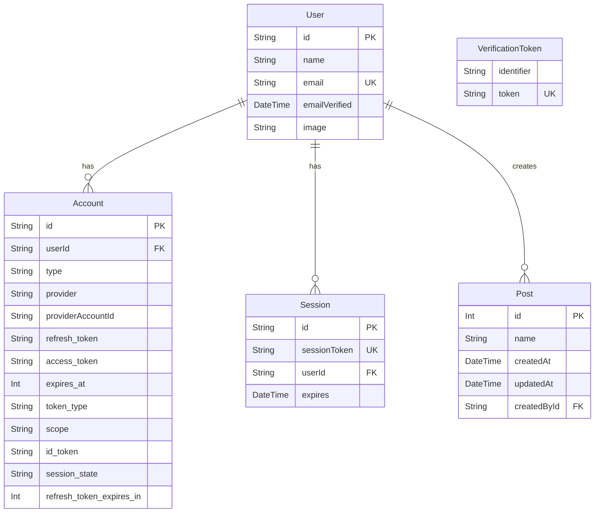

# 技术文档: my-t3-app

本文档旨在提供 `my-t3-app` 项目的全面技术概述，以帮助开发人员（和 AI 助手）快速了解其架构、技术栈和核心功能。

## 1. 项目概述

这是一个使用 `create-t3-app` 脚手架生成的全栈 Web 应用程序。它集成了 Next.js、TypeScript、tRPC、Prisma 和 NextAuth.js，提供了一个类型安全、高效开发的起点。项目已经配置了 Discord 作为身份验证提供商，并使用 Neon 托管的 PostgreSQL 数据库。项目已成功部署到 Vercel。

## 2. 技术栈

| 类别         | 技术                                          | 版本            | 备注                                       |
| :----------- | :-------------------------------------------- | :-------------- | :----------------------------------------- |
| **框架**     | [Next.js](https://nextjs.org/)                | `15.2.3`        | React 全栈框架                             |
| **语言**     | [TypeScript](https://www.typescriptlang.org/) | `5.8.2`         | JavaScript 的类型超集                      |
| **UI/样式**  | [Tailwind CSS](https://tailwindcss.com/)      | `4.0.15`        | 功能类优先的 CSS 框架                      |
| **ORM**      | [Prisma](https://www.prisma.io/)              | `6.5.0`         | 新一代 Node.js 和 TypeScript 的 ORM        |
| **数据库**   | [PostgreSQL](https://www.postgresql.org/)     | -               | 由 [Neon](https://console.neon.tech/) 托管 |
| **认证**     | [NextAuth.js](https://next-auth.js.org/)      | `5.0.0-beta.25` | 应用程序的身份验证解决方案                 |
| **环境变量** | [t3-env](https://env.t3.gg/)                  | `0.12.0`        | 类型安全的环境变量管理                     |
| **包管理器** | [pnpm](https://pnpm.io/)                      | `10.15.0`       | 快速、节省磁盘空间                         |

## 3. 数据库

数据库使用 Prisma 进行管理。数据源是 PostgreSQL，连接 URL 存储在环境变量 `DATABASE_URL` 中。

### 数据库模型图 (Mermaid)



### 模型描述

- **User**: 存储用户基本信息，如姓名、邮箱和头像。
- **Account**: 存储用户通过 OAuth 提供商（如 Discord）登录的信息。一个用户可以有多个 Account。
- **Session**: 存储用户的登录会话信息。
- **VerificationToken**: 用于邮箱验证等一次性令牌。
- **Post**: 一个示例模型，用于演示数据创建，与用户关联。

## 4. 认证流程

项目使用 NextAuth.js (Auth.js) 进行身份验证。

- **提供商 (Provider)**: 已配置 Discord 作为唯一的 OAuth 登录方式。配置文件位于 [`src/server/auth/config.ts`](src/server/auth/config.ts)。
- **适配器 (Adapter)**: 使用 `@auth/prisma-adapter` 将 NextAuth.js 的状态持久化到数据库中。这意味着用户信息、账户关联和会话都存储在 PostgreSQL 数据库中。
- **路由处理器**: NextAuth.js 的 API 路由位于 [`src/app/api/auth/[...nextauth]/route.ts`](src/app/api/auth/[...nextauth]/route.ts)，处理所有认证相关的请求（如登录、登出、回调）。

## 5. 项目结构

```
my-t3-app/
├── prisma/                  # Prisma schema, migrations
│   └── schema.prisma        # 数据库模型定义
├── public/                  # 静态资源
├── src/
│   ├── app/                 # Next.js App Router
│   │   ├── layout.tsx       # 全局布局
│   │   ├── page.tsx         # 首页
│   │   └── api/
│   │       └── auth/
│   │           └── [...nextauth]/
│   │               └── route.ts  # NextAuth.js 认证路由
│   ├── env.js               # t3-env 环境变量校验
│   ├── server/              # 服务器端代码
│   │   ├── auth/            # 认证相关配置
│   │   │   └── config.ts    # NextAuth.js 配置
│   │   └── db.ts            # Prisma Client 单例实例化
│   └── styles/              # 全局样式
│       └── globals.css
├── next.config.js           # Next.js 配置文件
├── package.json             # 项目依赖和脚本
└── tsconfig.json            # TypeScript 配置文件
```

## 6. 环境变量

项目依赖于一些环境变量来正常运行。这些变量应在根目录的 `.env` 文件中定义。

- `DATABASE_URL`: **必需**. PostgreSQL 数据库的连接字符串。
- `AUTH_DISCORD_ID`: **必需**. Discord OAuth application 的 Client ID。
- `AUTH_DISCORD_SECRET`: **必需**. Discord OAuth application 的 Client Secret。
- `AUTH_SECRET`: **必需**. 用于加密 JWT 和其他安全相关操作的随机字符串。可以通过 `openssl rand -base64 32` 生成。

可以参考 [`.env.example`](.env.example) 文件来创建自己的 `.env` 文件。
